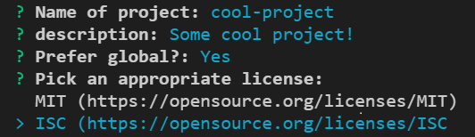

# lempit

> A simple CLI project scaffolder similar to [Khaos](https://github.com/segmentio/khaos).

[](https://badge.fury.io/js/lempit)
[](https://travis-ci.org/lempit/lempit)
[](https://raw.githubusercontent.com/lempit/lempit/master/LICENSE) 

## Installation

Prerequisites: [node.js](https://nodejs.org/en/), [npm](https://www.npmjs.com/get-npm) and [git](https://git-scm.com/).

``` bash
$ npm install -g lempit
```

## Usage

### lempit init

Is to create project boilerplate from local template or git repository template.

``` bash
$ lempit init <template-name> <project-name> [options]
```

#### Arguments

##### template-name
Git repository or local folder that contains project template. To create project from [`https://github.com/lempit/koa-typescript`](https://github.com/lempit/koa-typescript) you can simply specify `lempit/koa-typescript` as the `template-name`. For other repositories other than Github you have to specify the name of the repository in front of template directory:

**GitHub** - `github:owner/template-name` or `simply owner/template-name`

**GitLab** - `gitlab:owner/template-name`

**Bitbucket** - `bitbucket:owner/template-name`

##### project-name
The name of project.

##### options
-c, --clean  clean target directory

-h, --help   output usage information


#### Example

``` bash
$ lempit init lempit/koa-typescript my-project
```


### Template
To create a template you just need to create files filled with mustache template tags and put it under directory named `template`. **Lempit** works like [Khaos](https://github.com/segmentio/khaos) with some additional features:

#### Handlebars helpers

You can use two commonly used Handlebars helpers `raw-helper`, `if`, `if_eq` and `unless_eq`. The `if_eq` and `unless_eq` helpers intended to create a multiple choice questions. Thanks to [vue-cli](https://github.com/vuejs/vue-cli) for the idea!

#### Metadata file

While asking user to answer the questions, you may want to display a words rather than variable names. All you need to do is to create file either `meta.json` or `meta.js` under the root directory of your template. If you are using Handlebars helpers `if_eq` or `unless_eq`, then **metadata file** is required to define the **choices**.

#### Example

*./template/package.json*
```json
{
    "name": "{{name}}",
    "version": "0.0.1",
    "description": "{{description}}",
{{#if preferGlobal}}
    "preferGlobal": true,
{{/if}}
{{#unless_eq license "mit"}}
    "private": true,
{{/unless_eq}}
    "license": "{{#if_eq license "mit"}}MIT{{/if_eq}}{{#if_eq license "isc"}}ISC{{/if_eq}}"    
}
```

*./meta.json*
```json
{
  "prompts": {
    "name": {
      "message": "Name of project",
      "required": true
    },
    "preferGlobal": {
      "message": "Prefer global?"
    },
    "license": {			
      "message": "Pick an appropriate license",
      "choices": [
        {
          "name": "MIT (https://opensource.org/licenses/MIT)",
          "value": "mit",
          "short": "MIT"
        },
        {
          "name": "ISC (https://opensource.org/licenses/ISC",
          "value": "isc",
          "short": "ISC"
        }
      ]
    }
  }
}
```

*Prompts:*



*Result:*

```json
{
    "name": "cool-project",
    "version": "0.0.1",
    "description": "Some cool project!",
    "preferGlobal": true,
    "private": true,
    "license": "ISC"    
}
```

A [Khaos](https://github.com/segmentio/khaos) template should be works too for **Lempit**.


### lempit new

Is to generate project files in a project.
This command is very usefull when you often writing code using similar pattern. 
All you have todo is to store your templates in `.lempit` directory under project root directory,
then execute `lempit new <directory or file in .lempit directory> <destination directory or file> [options]`.

Put your `meta.json` as well as if needed in `.lempit` directory.

Use `-f` or `--file` options if you want to generate single file with different name.

#### Structure

```
root directory
├── .lempit
|    ├── meta.json              # lempit metadata            
|    ├── foo_template_dir       # a template directory
|    |   ├── foo1.js            #   template files
|    |   └── foo2.js
|    ├── baz_template_dir       # another template directory
|    |   ├── baz1.js            #   template files
|    |   └── baz2.js
|    └── foo_template.js        # a template file
└── Your project dir/files      # actual project files

```

#### Usage example


##### Generate from directory

```bash
$ lempit new foo_template_dir ./components/foo
```

Generate files (`foo1.js` and `foo2.js`) from `/.lempit/foo_template_dir` directory into `/components/foo`. 
This action will creates `/components/foo` under you root project directory automatically. 


##### Generate from file

```bash
$ lempit new foo_template_dir/foo1.js ./components/foo
```

Generate file from `/.lempit/foo_template_dir/foo1.js` directory into `/components/foo` directory.


##### Generate from file as new file name (-r or --rename option)

```bash
$ lempit new foo_template_dir/foo1.js ./components/meh1.js -r
```

Generate file from `/.lempit/foo_template_dir/foo1.js` directory into `/components/meh1.js`.


## Credits
[Khaos](https://github.com/segmentio/khaos)

[Metalsmith](http://www.metalsmith.io/)

[handlebarsjs](http://handlebarsjs.com/)

[Inquirer.js](https://github.com/SBoudrias/Inquirer.js)

[vue-cli](https://github.com/vuejs/vue-cli)


## License
[MIT](https://github.com/lempit/lempit/blob/master/LICENSE)